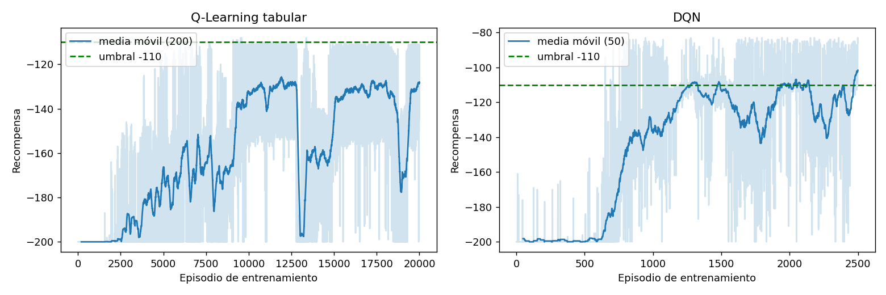
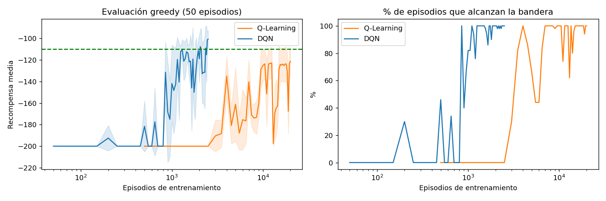
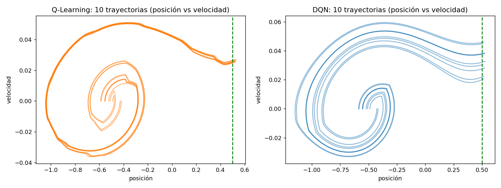
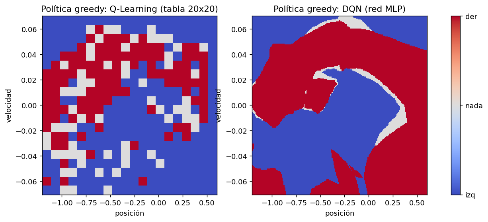
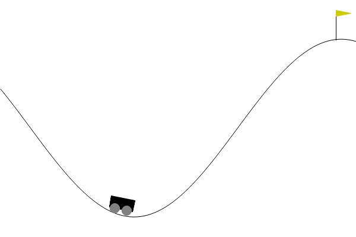
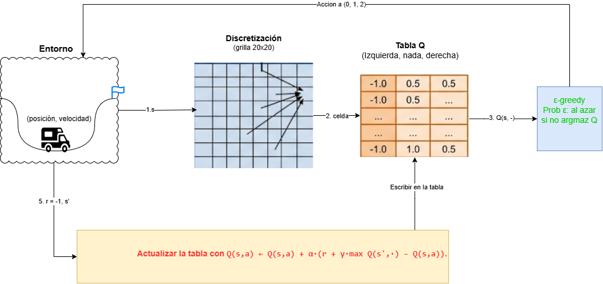
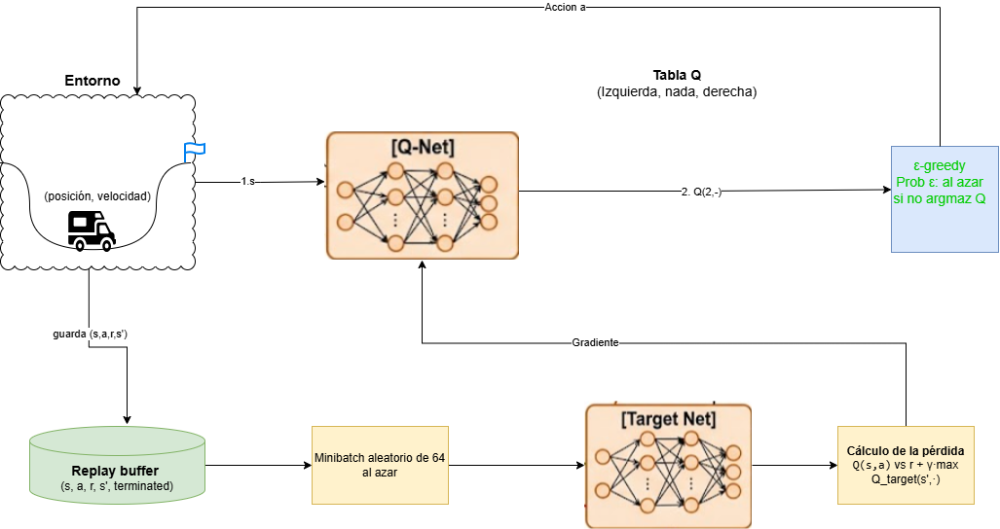

# Simulación y aprendizaje por refuerzo - Mastria en Inteligencia Artificial
### Integrantes: Alvaro Jimenez, Claudia Soto, Juan Tovar, Oscar Mantilla, Padro Martinez, Oscar Torres
## MountainCar-v0: Q-Learning tabular vs. Deep Q-Network

Actividad de Aprendizaje por Refuerzo. Se implementan **desde cero** (sin Stable-Baselines) dos agentes sobre
[MountainCar-v0](https://gymnasium.farama.org/environments/classic_control/mountain_car/) y se comparan:

1. **Q-Learning tabular** con discretización del espacio de estados (grilla 20x20).
2. **DQN** con una MLP, replay buffer, red objetivo y exploración temporalmente correlacionada.

Repositorio base: [emiliomunozai/mountain_car](https://github.com/emiliomunozai/mountain_car). Los ejercicios originales
(`EXERCISES.md`) quedaron resueltos en `src/mountain_car/agents/`.

## Resultados (mejor modelo de cada método)

Evaluación greedy (sin exploración) sobre **100 episodios con semillas distintas a las de selección del checkpoint**
(`python scripts/make_report.py`, detalle en `results/summary.json`):

| Métrica | Q-Learning tabular | DQN |
|---|---:|---:|
| Recompensa media (100 ep.) | **-125.6** ± 13.5 | **-100.1** ± 8.1 |
| Mejor / peor episodio | -111 / -148 | -83 / -109 |
| Episodios que llegan a la bandera | 100 % | 100 % |
| Episodios de entrenamiento hasta >= 90 % de éxito | 4 000 | 850 |
| Episodios hasta recompensa media >= -130 | 9 500 | 1 150 |
| Episodios totales entrenados | 20 000 | 2 500 |
| Tiempo de entrenamiento (CPU, 1 hilo) | ~72 s | ~574 s |
| Parámetros | 400 celdas x 3 acciones (297 visitadas) | 17 283 pesos |

> Umbral convencional de "resuelto": -110. DQN lo supera; Q-Learning tabular queda cerca pero por encima (peor).
> Nota: el checkpoint "mejor" se elige por la evaluación con semillas 1000-1049; las cifras de la tabla se miden con
> semillas 5000-5099 para evitar reportar un resultado sesgado por la selección.

### Evidencia visual

| | |
|---|---|
| Curvas de entrenamiento |  |
| Evaluación greedy vs. episodios |  |
| Trayectorias del mejor modelo en el plano posición-velocidad |  |
| Política greedy aprendida por cada agente |  |

Logs completos: `results/qlearning_log.txt`, `results/dqn_log.txt`; historiales en `results/*_history.json`.
Los mejores modelos están en `saves/qlearning_best.pkl` y `saves/dqn_best.pt`.

### Simulación de los mejores modelos

Ambos agentes parten del mismo estado inicial (semilla 5000).

| Q-Learning tabular | DQN |
|:---:|:---:|
|  |  |


## Esquemas del proceso de entrenamiento




## Paso 2 — Q-Learning tabular

**Discretización.** La observación (posición, velocidad) se divide en `20 x 20 = 400` celdas con `np.digitize` sobre los
límites que publica el entorno. Cada celda es una clave de la tabla Q (`defaultdict` de vectores de 3 acciones).
Solo se visitan ~297 celdas (el resto son combinaciones físicamente inalcanzables).

**Actualización (TD):** `Q(s,a) <- Q(s,a) + lr * (r + gamma * max_a' Q(s',a') - Q(s,a))`, sin bootstrap si `terminated`
(llegar a la bandera). El corte por 200 pasos (`truncated`) **no** se trata como estado terminal.

| Hiperparámetro | Valor |
|---|---|
| `n_bins` | 20 |
| `lr` | 0.1 |
| `gamma` | 0.99 |
| epsilon | 1.0 -> 0.01, decaimiento 0.9995 por episodio |
| Episodios | 20 000 |
| Semilla | 0 |

Comportamiento observado: recompensa fija en -200 durante ~2 500 episodios (ninguna ruta hacia la bandera aprendida),
luego sube de forma irregular (con caídas) y se estabiliza cerca de -125 hacia el final.

## Paso 3 — DQN

**Red:** MLP `2 -> 128 -> 128 -> 3`, ReLU, sin activación en la salida. Replay buffer de 100 000 transiciones, red objetivo
sincronizada cada 10 episodios, pérdida MSE, optimizador Adam. En `_learn` se guarda `terminated` (no `done`) como bandera
terminal y el objetivo es `r + gamma * max_a' Q_target(s',a') * (1 - terminated)`.

| Hiperparámetro | Valor |
|---|---|
| `lr` (Adam) | 1e-3 |
| `gamma` | 0.99 |
| epsilon | 1.0 -> 0.01, decaimiento 0.995 por episodio |
| `sticky_prob` (exploración pegajosa) | 0.9 |
| `batch_size` | 64 |
| `buffer_capacity` | 100 000 |
| `target_update_freq` | 10 episodios |
| `hidden` | 128 |
| Episodios | 2 500 |
| Semilla | 0 |

### El problema de la exploración (Ejercicio 3)

Con epsilon-greedy estándar, DQN se queda **completamente plano en -200**: MountainCar da -1 en cada paso, así que sin
haber llegado nunca a la bandera todos los estados valen lo mismo, y una política aleatoria con acciones independientes
por paso casi nunca produce las rachas sostenidas de empuje que hacen falta para salir del valle (probabilidad de
20 acciones iguales seguidas ~ (1/3)^20). La corrección solo cambia **cómo se explora**: con probabilidad `sticky_prob`
el agente repite la última acción exploratoria; el estado se reinicia al comenzar cada episodio, y la evaluación
(`deterministic=True`) sigue siendo greedy puro. `sticky_prob` se guarda en `_HPARAMS`.

Ablación (`sticky_prob=0.0`, misma semilla, `results/dqn_ablation_no_sticky.txt`): **0 de 1000 episodios
alcanzaron la bandera (recompensa -200.00 en todos los bloques)**, mientras que con `sticky_prob=0.9` el agente empieza a
llegar a la bandera hacia el episodio ~850.

## Paso 4 — Comparación

| Aspecto | Q-Learning tabular | DQN |
|---|---|---|
| **Velocidad de aprendizaje (episodios)** | Lenta: ~4 000 episodios para 90 % de éxito | ~5x más rápida por episodio (850) |
| **Velocidad (tiempo real)** | Mucho más rápida: 72 s totales, actualización O(1) por paso | ~8x más lenta: cada paso hace un paso de gradiente |
| **Estabilidad** | Oscila mucho, con caídas bruscas (ver 12-14k episodios) por el ruido de la discretización | También oscila entre checkpoints (~1 200-2 000 episodios); la variabilidad entre checkpoints al final es similar (~13 pts en ambos), pero la varianza entre episodios de evaluación es menor (8.1 vs 13.5) |
| **Desempeño final** | -125.6 (no llega al umbral de -110) | -100.1 (supera el umbral) |
| **Generalización** | Ninguna entre celdas: cada una se aprende por separado, la política es ruidosa (ver figura) | Aproxima una política suave y continua; generaliza entre estados cercanos |
| **Dificultad de implementación** | Baja: una tabla y una línea de actualización | Media/alta: red, buffer, red objetivo, formas de tensores, exploración correlacionada |
| **Sensibilidad a hiperparámetros** | Depende mucho de `n_bins`: pocos pierde precisión, muchos no escala | Sensible a lr, frecuencia de la red objetivo y al esquema de exploración |
| **Escalabilidad** | Explota con más dimensiones (maldición de la dimensionalidad) | Escala a espacios continuos y de mayor dimensión |
| **Interpretabilidad** | Alta: se puede inspeccionar la tabla | Baja: red opaca |

**Conclusión.** En un problema pequeño (2 dimensiones) el método tabular funciona y es barato, pero exige discretizar y
converge a una política más ruidosa. DQN aprende una política mejor y con muchos menos episodios porque generaliza, a costa
de mayor complejidad, más cómputo por episodio y una dependencia crítica de la estrategia de exploración. El flag reward
escaso de MountainCar hace que **la exploración sea el factor decisivo**, incluso más que el algoritmo de aprendizaje.

### Limitaciones de este experimento

- Una sola semilla de entrenamiento por método (los resultados varían entre corridas).
- El mejor checkpoint se elige por evaluación durante el entrenamiento (con semillas de selección distintas a las de la tabla final).
- Q-Learning no se sintonizó (`n_bins`, `lr`, decaimiento); un ajuste podría acercarlo a DQN.

## Reproducir

```bash
uv sync                          # o: pip install -e . matplotlib
python scripts/run_experiment.py qlearning --episodes 20000 --chunk 500
python scripts/run_experiment.py dqn --episodes 2500 --chunk 50
python scripts/make_report.py    # figuras + results/summary.json
uv run mountaincar load dqn --eval
```
### Colab donde se ejecutó:
https://colab.research.google.com/drive/1TXizXqsEqTg-9PDMhSCArFLgNZqBhezL?usp=sharing


---

# Referencia del repositorio base


A hands-on repo for understanding how Reinforcement Learning works.
Train, inspect, and visualise RL agents on [MountainCar-v0](https://gymnasium.farama.org/environments/classic_control/mountain_car/) (or any other Gymnasium environment).

**This repo is a set of exercises.** The CLI, training loops and persistence are
written; the algorithms themselves are left as marked `EXERCISE` stubs for you
to fill in. Start with **[EXERCISES.md](EXERCISES.md)**.
